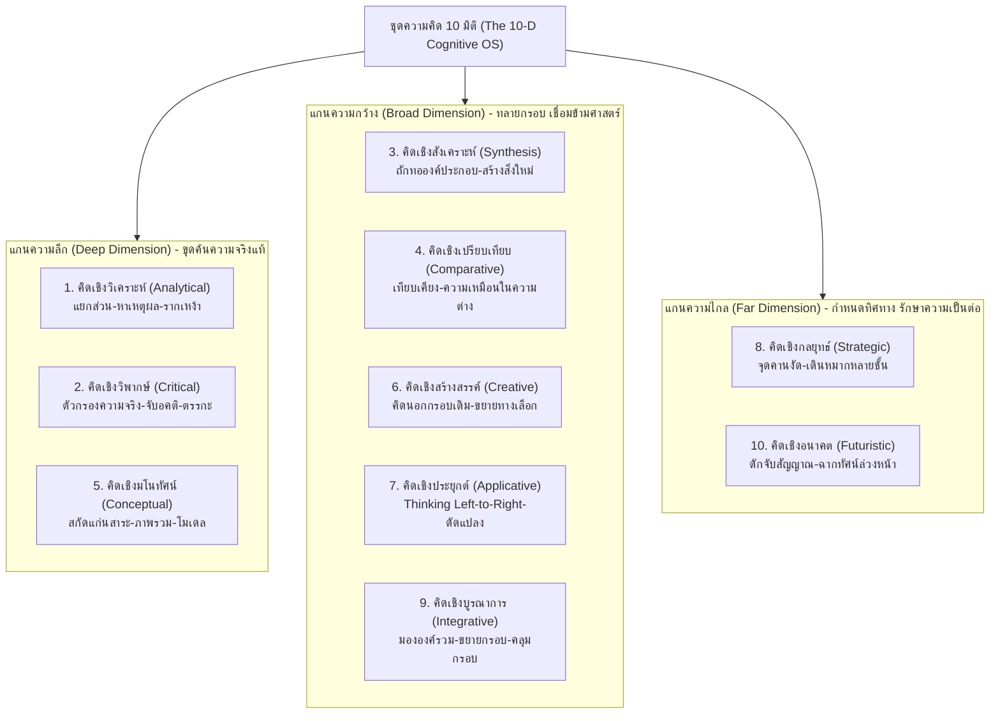

# Ten Thinking Dimensions Cognitive OS (ผู้ชนะ 10 คิด)

ระบบปฏิบัติการทางปัญญาตามแบบแผน **"ผู้ชนะ 10 คิด"** และ **"ลายแทงนักคิด"** ของ **ศ.ดร.เกรียงศักดิ์ เจริญวงศ์ศักดิ์ (ดร.แดน)** สำหรับการคิดเพื่อแก้ปัญหาที่ซับซ้อน (Complex Problem Solving) และการขับเคลื่อนนวัตกรรมเชิงปฏิรูป (Transformative Innovation) บนแกนพิกัด **"กว้าง - ลึก - ไกล"** อย่างเฉียบคมและเชื่อมโยงกัน

---

## 1. สถาปัตยกรรมแกนพิกัด 3 มิติ (The 3D Thinking Coordinates)

การคิดที่มีพลังสูงสุดต้องผสานทั้ง 3 แกนพิกัด ไม่ติดหล่มอยู่เพียงแกนใดแกนหนึ่ง:



### อันตรายของการขาดมิติใดมิติหนึ่ง:
- **ลึกแต่ไม่กว้าง:** หมกมุ่นในรายละเอียด คับแคบ ขาดจินตนาการ มองไม่เห็นภาพรวมและการเชื่อมโยง
- **กว้างแต่ไม่ลึก:** ผิวเผิน ลอยละล่อง ไม่เข้าใจแก่นแท้ แก้ปัญหาบนสมมติฐานที่ผิดพลาด
- **ลึกและกว้างแต่ไม่ไกล:** เก่งเฉพาะหน้า แต่ตาบอดต่ออนาคต ไร้ทิศทางระยะยาว ถูกคลื่น Disruption กลืนกิน
- **ไกลแต่วิเคราะห์ไม่ลึกและไม่กว้าง:** กลายเป็นเพียงความเพ้อฝันที่จับต้องไม่ได้และนำไปปฏิบัติจริงไม่ได้

---

## 2. ตารางสรุป 10 มิติการคิด (Master Matrix)

| # | มิติการคิด (Dimension) | แกนหลัก | เป้าประสงค์ทางปัญญา | คำถามชี้นำแกนกลาง (Core Prompt) | ผลผลิตเชิงประจักษ์ (Artifact) |
|---|---|---|---|---|---|
| **1** | [คิดเชิงวิเคราะห์](./references/01_analytical_thinking.md) | **ลึก** | จำแนกองค์ประกอบและหาความสัมพันธ์เชิงเหตุผล | *"เรื่องนี้ประกอบด้วยส่วนย่อยอะไร และส่งผลกระทบถึงกันอย่างไร?"* | แผนผังโครงสร้างเหตุและผล (Root Cause Tree) |
| **2** | [คิดเชิงวิพากษ์](./references/02_critical_thinking.md) | **ลึก** | ตรวจสอบข้อสมมติฐาน ความถูกต้อง และความน่าเชื่อถือ | *"เรื่องนี้จริงแท้แค่ไหน มีหลักฐานอะไรสนับสนุน และมีอคติหรือไม่?"* | ข้อสรุปที่ผ่านการกรองความจริง ปราศจากตรรกะวิบัติ |
| **3** | [คิดเชิงสังเคราะห์](./references/03_synthesis_thinking.md) | **กว้าง** | หลอมรวมองค์ประกอบย่อยให้เกิดเป็นสิ่งใหม่หรือแนวคิดใหม่ | *"นำแก่นสาระเหล่านี้มาถักทอจัดระเบียบใหม่เป็นอะไรได้บ้าง?"* | โมเดลแนวคิดใหม่ หรือนวัตกรรมที่สมบูรณ์ |
| **4** | [คิดเชิงเปรียบเทียบ](./references/04_comparative_thinking.md) | **กว้าง** | ค้นหาความเหมือนและความต่างบนเกณฑ์มาตรฐาน | *"สิ่งเหล่านี้มีความเหมือนและความต่างกันอย่างไรตามเกณฑ์นี้?"* | เมทริกซ์เปรียบเทียบ / อุปมาอุปไมยข้ามศาสตร์ |
| **5** | [คิดเชิงมโนทัศน์](./references/05_conceptual_thinking.md) | **ลึก** | สกัดแก่นแท้นามธรรมให้กลายเป็นความคิดรวบยอด | *"อะไรคือแก่นแท้และสาระสำคัญสูงสุดของปรากฏการณ์นี้?"* | นิยามแก่นหลักการใน 1 ประโยค / โมเดลเชิงสัญลักษณ์ |
| **6** | [คิดเชิงสร้างสรรค์](./references/06_creative_thinking.md) | **กว้าง** | ผลิตแนวคิดแปลกใหม่ ยืดหยุ่น และสร้างมูลค่าเพิ่มเชิงบวก | *"มีทางเลือกอื่นที่แปลกใหม่และสร้างคุณค่าได้มากกว่านี้ไหม?"* | บัญชีไอเดียริเริ่มนอกกรอบเดิม (Divergent Options) |
| **7** | [คิดเชิงประยุกต์](./references/07_applicative_thinking.md) | **กว้าง** | ถ่ายโอนและดัดแปลงหลักการเดิมไปใช้ในบริบทใหม่ | *"จะนำกลไกความสำเร็จนี้ไปดัดแปลงใช้กับสถานการณ์ใหม่ได้อย่างไร?"* | โซลูชันการปรับใช้จริงหน้างาน (Left-to-Right Transfer) |
| **8** | [คิดเชิงกลยุทธ์](./references/08_strategic_thinking.md) | **ไกล** | กำหนดเป้าหมาย ออกแบบชั้นเชิง และสร้างความได้เปรียบ | *"จะวางหมากอย่างไรเพื่อสร้างความเป็นต่อและบรรลุชัยชนะสูงสุด?"* | แผนที่กลยุทธ์ (Roadmap), จุดคานงัด, ปราการแข่งขัน |
| **9** | [คิดเชิงบูรณาการ](./references/09_integrative_thinking.md) | **กว้าง** | เชื่อมประสานทุกมิติให้กลมกลืนแบบองค์รวม (1+1 > 2) | *"จะขยายและคลุมกรอบเพื่อสลายความขัดแย้งและผสานพลังได้อย่างไร?"* | แผนผังสถาปัตยกรรมระบบองค์รวม (Holistic Synergy) |
| **10** | [คิดเชิงอนาคต](./references/10_futuristic_thinking.md) | **ไกล** | วิเคราะห์แนวโน้ม คาดการณ์ฉากทัศน์ และเตรียมการล่วงหน้า | *"ในอนาคตจะเกิดฉากทัศน์ใด และต้องเตรียมพร้อมอย่างไรตั้งแต่วันนี้?"* | ฉากทัศน์อนาคต (Best / Base / Worst Case Scenarios) |

---

## 3. ระบบคัดแยกและเส้นทางการนำไปใช้ (Autonomous Dispatch Engine)

เมื่อผู้ใช้ส่งคำขอหรือโจทย์เข้ามา ให้ตรวจสอบเจตนาเพื่อเลือกใช้กระบวนการที่เหมาะสม:

### Route 1: การแก้ไขปัญหาที่ซับซ้อน (Complex Problem Solving)
หากโจทย์คือ: วิกฤตธุรกิจ, ปัญหาองค์กร, ผลลัพธ์ไม่เป็นไปตามเป้า, ปัญหาขัดแย้งเชิงโครงสร้าง
➡️ **เรียกใช้:** [Playbook A: Complex Problem Solving Protocol](./references/playbook_complex_problem_solving.md)

### Route 2: การพัฒนาและขับเคลื่อนนวัตกรรม (Transformative Innovation)
หากโจทย์คือ: สร้างสินค้า/บริการใหม่, ออกแบบโมเดลธุรกิจใหม่, หา Blue Ocean, พลิกโฉมอุตสาหกรรม
➡️ **เรียกใช้:** [Playbook B: Transformative Innovation Pipeline](./references/playbook_transformative_innovation.md)

### Route 3: การประเมินกลยุทธ์และวิสัยทัศน์ระยะยาว (Strategic Foresight & Moat)
หากโจทย์คือ: วางแผนกลยุทธ์องค์กร, วิเคราะห์คู่แข่ง, สร้างปราการป้องกันความเสี่ยง (Moat)
➡️ **เรียกใช้:** โฟกัสคู่ประสานมิติ **คิดเชิงอนาคต (10) + คิดเชิงกลยุทธ์ (8) + คิดเชิงบูรณาการ (9)**

### Route 4: การวิเคราะห์เชิงลึกเฉพาะมิติ (Targeted Thinking Dimension)
หากผู้ใช้ระบุหรือต้องการเจาะจงมิติใดมิติหนึ่งโดยเฉพาะ (เช่น ตรวจสอบความจริงของข้อมูล หรือ คิดนอกกรอบ)
➡️ **เปิดอ่านคู่มือมิตินั้นโดยตรง** ในโฟลเดอร์ [references/](./references/)

---

## 4. Playbook A: โปรโตคอลแก้ปัญหาซับซ้อน 4 ขั้นตอน (Complex Problem Solving)

ใช้แก้ปัญหาที่มีตัวแปรหลากหลายและผลกระทบสูง ผ่าน 4 จังหวะการคิดประสานมิติ:

```text
[ขั้นที่ 1: ชำแหละและถอดรหัสปัญหา]
   ├── วิพากษ์ (Critical): แยกข้อเท็จจริงออกจากความเห็น ตรวจสอบสมมติฐาน
   ├── วิเคราะห์ (Analytical): แยกองค์ประกอบโครงสร้าง หา Root Cause ตามหลัก MECE
   └── มโนทัศน์ (Conceptual): สรุปนิยาม "แก่นแท้ของโจทย์" ใน 1 ประโยคชัดเจน
          ▼
[ขั้นที่ 2: ระดมทางเลือกและออกแบบโซลูชัน]
   ├── เปรียบเทียบ (Comparative): Benchmarking กับกรณีศึกษาและอุปมาอุปไมยข้ามวงการ
   ├── สร้างสรรค์ (Creative): แตกไอเดีย 4 เสาหลัก (ริเริ่ม ยืดหยุ่น คล่องแคล่ว ประณีต)
   ├── ประยุกต์ (Applicative): นำ Best Practice จากศาสตร์อื่นมาดัดแปลง (Left-to-Right)
   └── สังเคราะห์ (Synthesis): หลอมรวมชิ้นส่วนทางเลือกเป็น Solution Package ที่สมบูรณ์
          ▼
[ขั้นที่ 3: วางตำแหน่งกลยุทธ์และประเมินอนาคต]
   ├── อนาคต (Futuristic): ฉายภาพผลกระทบระลอก 2-3 และทดสอบ 3 ฉากทัศน์
   └── กลยุทธ์ (Strategic): หา "จุดคานงัด" (Leverage Point) ที่ลงทุนน้อยสุดแต่ได้ผลสูงสุด
          ▼
[ขั้นที่ 4: เชื่อมประสานระบบและการลงมือปฏิบัติการ]
   └── บูรณาการ (Integrative): ขยายกรอบและคลุมกรอบ สลายความขัดแย้งของทุกภาคส่วน (1+1>2)
```

---

## 5. Playbook B: ท่อส่งนวัตกรรม 10 มิติ (The 10-D Innovation Pipeline)

เปลี่ยนแนวคิดนามธรรมให้กลายเป็นผลิตภัณฑ์ โมเดลธุรกิจ หรือบริการที่พลิกโฉมวงการ:

1. **ระยะที่ 1: ค้นหาช่องว่างที่ซ่อนอยู่ (Uncovering Latent Gaps)**
   - *วิเคราะห์ (Analytical):* ชำแหละ Value Chain หา Pain Point และจุดฝืดเคือง
   - *วิพากษ์ (Critical):* ท้าทายความเชื่อเดิมของอุตสาหกรรมที่คนอื่นคิดว่าเป็นเรื่องจริง
2. **ระยะที่ 2: ตกผลึกแก่นคุณค่าใหม่ (Formulating Core Conceptual Value)**
   - *มโนทัศน์ (Conceptual):* สกัด Unmet Needs ให้กลายเป็นแก่นปรัชญาคุณค่า (Core Value Proposition)
3. **ระยะที่ 3: กระโดดข้ามพรมแดนเดิม (Cross-boundary Ideation)**
   - *เปรียบเทียบ (Comparative):* นำบริบทจากอุตสาหกรรมอื่นที่ไม่มีความเกี่ยวข้องกันมาเทียบเคียง
   - *สร้างสรรค์ (Creative):* พลิกกลับด้านสมมติฐาน (Inversion) ตัดแต่งคุณสมบัติเดิม
4. **ระยะที่ 4: สร้างสถาปัตยกรรมต้นแบบ (Prototype Architecture)**
   - *ประยุกต์ (Applicative):* ถ่ายโอนเทคโนโลยี/โมเดลที่สำเร็จในอุตสาหกรรมอื่นมาดัดแปลง
   - *สังเคราะห์ (Synthesis):* ถักทอเทคโนโลยี ประสบการณ์ และโมเดลรายได้เข้าด้วยกันอย่างกลมกลืน
5. **ระยะที่ 5: ฉายภาพอนาคตและสร้างปราการทางธุรกิจ (Future Alignment & Strategic Moat)**
   - *อนาคต (Futuristic):* ทดสอบกับ Megatrends ในอีก 5-10 ปีข้างหน้า
   - *กลยุทธ์ (Strategic):* ออกแบบคูเมืองทางธุรกิจ (Network Effects, Switching Costs, Cost Advantages)
6. **ระยะที่ 6: หลอมรวมระบบนิเวศนวัตกรรม (Ecosystem Integration)**
   - *บูรณาการ (Integrative):* ผนึกกำลังพันธมิตร ซัพพลายเออร์ และผู้ใช้งานให้เกิดพลังทวีคูณ

---

## 6. แนวทางการตอบและการจัดทำรายงาน (Deliverable Standards)

เมื่อผู้ใช้ขอให้วิเคราะห์หรือแก้ปัญหาด้วยชุดความคิด 10 มิติ ให้จัดโครงสร้างคำตอบในรูปแบบ **10-Think Executive Dossier**:
1. **Executive Summary & Conceptual Core:** สรุปแก่นแท้ของโจทย์ใน 1 ประโยคคมชัด
2. **Deep Dimension (การขุดค้นเชิงลึก):** Root Cause Tree และการกลั่นกรองข้อเท็จจริงปราศจากอคติ
3. **Broad Dimension (ทางออกและนวัตกรรมเชิงกว้าง):** ทางเลือกนอกกรอบ การประยุกต์ข้ามสายงาน และโซลูชันสังเคราะห์
4. **Far Dimension (กลยุทธ์และฉากทัศน์อนาคต):** ฉากทัศน์ Best/Base/Worst, จุดคานงัด, และคูเมืองความได้เปรียบ
5. **Systemic Integration (แผนผังการขับเคลื่อนองค์รวม):** แผนที่การบูรณาการทุกฝ่ายเพื่อลงมือปฏิบัติจริง

---

## 7. รายการเอกสารอ้างอิงฉบับสมบูรณ์ (Reference Library)

- [00. ปรัชญาและวิทยาศาสตร์ทางสมอง (Core Philosophy)](./references/00_core_philosophy.md)
- [01. การคิดเชิงวิเคราะห์ (Analytical Thinking)](./references/01_analytical_thinking.md)
- [02. การคิดเชิงวิพากษ์ (Critical Thinking)](./references/02_critical_thinking.md)
- [03. การคิดเชิงสังเคราะห์ (Synthesis Thinking)](./references/03_synthesis_thinking.md)
- [04. การคิดเชิงเปรียบเทียบ (Comparative Thinking)](./references/04_comparative_thinking.md)
- [05. การคิดเชิงมโนทัศน์ (Conceptual Thinking)](./references/05_conceptual_thinking.md)
- [06. การคิดเชิงสร้างสรรค์ (Creative Thinking)](./references/06_creative_thinking.md)
- [07. การคิดเชิงประยุกต์ (Applicative Thinking)](./references/07_applicative_thinking.md)
- [08. การคิดเชิงกลยุทธ์ (Strategic Thinking)](./references/08_strategic_thinking.md)
- [09. การคิดเชิงบูรณาการ (Integrative Thinking)](./references/09_integrative_thinking.md)
- [10. การคิดเชิงอนาคต (Futuristic Thinking)](./references/10_futuristic_thinking.md)
- [คู่มือ Playbook การแก้ปัญหาซับซ้อน (Complex Problem Solving)](./references/playbook_complex_problem_solving.md)
- [คู่มือ Playbook นวัตกรรมเชิงปฏิรูป (Transformative Innovation)](./references/playbook_transformative_innovation.md)
- [คำถามตรวจสอบความคิดและเกณฑ์บ่งชี้สมรรถนะ (Rubrics & Checklists)](./references/rubrics_and_checklists.md)
