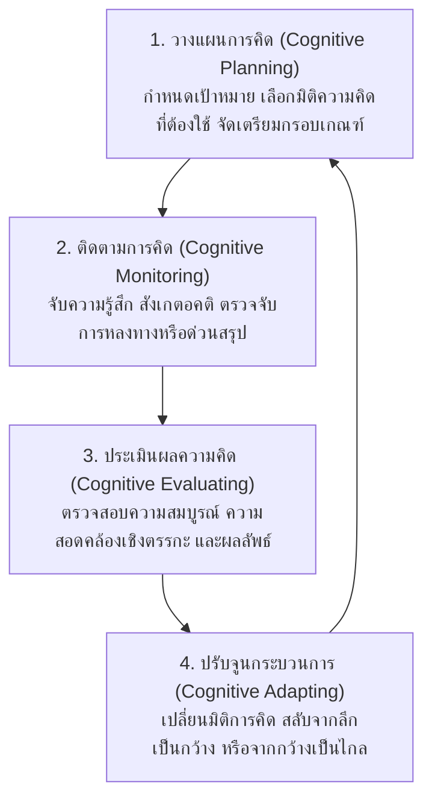

# 00. ปรัชญาพื้นฐานและวิทยาศาสตร์ทางปัญญา (Core Philosophy & Cognitive Science)

> เอกสารอ้างอิงหลักจากหนังสือชุด *"ลายแทงนักคิด"* และ *"ผู้ชนะ 10 คิด"* โดย ศ.ดร.เกรียงศักดิ์ เจริญวงศ์ศักดิ์

---

## 1. วิกฤตทางปัญญา: "คิดได้" vs "คิดเป็น"

มนุษย์ทุกคนเกิดมาพร้อมกับความสามารถในการคิดตามธรรมชาติ แต่มีความแตกต่างอย่างมีนัยสำคัญระหว่างระดับการคิดสองระดับ:

| ระดับการคิด | ลักษณะการทำงาน | ผลลัพธ์ที่เกิดขึ้น |
|---|---|---|
| **คิดได้ (Can Think)** | คิดตามสัญชาตญาณ ปฏิกิริยาสะท้อนกลับเฉพาะหน้า ทำตามความคุ้นชินเดิม หรือยอมจำนนต่ออารมณ์และอคติ | แก้ปัญหาแบบปะผุ มองเห็นแค่อาการภายนอก ตกเป็นเหยื่อของตรรกะวิบัติ และเกิดความผิดพลาดซ้ำซาก |
| **คิดเป็น (Knowing How to Think)** | การรู้เท่าทันกระบวนการคิดของตนเอง (**Metacognition**) สามารถสั่งการ ควบคุม และกำกับเครื่องมือทางปัญญาให้ทำงานอย่างมีแบบแผน เป็นระบบ รอบด้าน และมีประสิทธิผลสูงสุด | มองเห็นรากเหง้าของปัญหา สกัดแก่นสาระได้แม่นยำ สร้างสรรค์นวัตกรรมใหม่ได้ และกำหนดทิศทางอนาคตได้อย่างมีชัยชนะ |

กรอบความคิด 10 มิติ ได้รับการออกแบบขึ้นมาเป็น **ระบบปฏิบัติการทางปัญญา (Cognitive Operating System)** เพื่อเปลี่ยนมนุษย์จากการเป็นผู้ที่เพียงแค่ "คิดได้" ไปสู่การเป็น "ผู้ชนะทางความคิดที่คิดเป็นอย่างแท้จริง"

---

## 2. ฐานรากทางวิทยาศาสตร์สมอง (Neuroscience Foundations)

โครงสร้างการคิดของมนุษย์วางอยู่บนการทำงานประสานกันของสมองแต่ละส่วน:
- **สมองกลีบหน้า (Frontal Lobe):** ศูนย์บัญชาการการคิดขั้นสูง (Executive Functions) การวางแผนเชิงกลยุทธ์ การตัดสินใจ และการควบคุมตนเอง
- **สมองกลีบข้าง (Parietal Lobe):** การประมวลผลเชิงพื้นที่ การจัดโครงสร้าง และการบูรณาการข้อมูลผัสสะ
- **สมองกลีบขมับ (Temporal Lobe):** ศูนย์กลางความจำ ภาษา และการสร้างมโนทัศน์ (Conceptualization)
- **สมองกลีบท้ายทอย (Occipital Lobe):** การประมวลผลข้อมูลภาพและการจินตนาการภาพฉากทัศน์
- **แกนสมองและไฮโปทาลามัส (Brainstem & Hypothalamus):** สัญชาตญาณเพื่อความอยู่รอดและการตอบสนองต่อภัยคุกคามแบบ Fight-or-Flight

หากปราศจากการกำกับอย่างมีสติ กระบวนการตัดสินใจมักจะถูกครอบงำด้วยสัญชาตญาณดิบและการคิดแบบทางลัด (Heuristics) ซึ่งนำไปสู่อคติและความผิดพลาดทางกลยุทธ์

---

## 3. สี่ตัวร่วมขณะคิด (The 4 Co-factors of Thinking)

คุณภาพของการคิดในทุกขณะ ไม่ได้ขึ้นอยู่กับข้อมูลนำเข้าเพียงอย่างเดียว แต่ถูกหล่อหลอมผ่าน "4 ตัวร่วมขณะคิด" ที่ทำหน้าที่เป็นตัวกรองและเบ้าหลอมข้อมูล:

```text
               ┌───────────────────────────────────────────────┐
               │              ข้อมูลนำเข้า (Data Input)         │
               └───────────────────────┬───────────────────────┘
                                       │
                ┌──────────────────────▼──────────────────────┐
                │             4 ตัวร่วมขณะคิด (Co-factors)      │
                │ 1. โลกทัศน์และชีวทัศน์ (Worldview / Paradigm) │
                │ 2. อุปนิสัยแห่งการคิด (Thinking Habits)       │
                │ 3. สภาวะอารมณ์และจิตใจ (Emotional State)      │
                │ 4. ค่านิยมและคลังประสบการณ์เดิม (Values/Memory)│
                └──────────────────────┬──────────────────────┘
                                       │
               ┌──────────────────────▼───────────────────────┐
               │            ผลลัพธ์ทางปัญญา (Cognitive Output)  │
               └───────────────────────────────────────────────┘
```

1. **โลกทัศน์และชีวทัศน์ (Worldview / Paradigm):** กรอบแว่นตาที่ใช้มองความจริง เช่น มองโลกแบบผลรวมเป็นศูนย์ (Zero-sum) หรือมองแบบสร้างสรรค์คุณค่าร่วม (Win-Win)
2. **อุปนิสัยแห่งการคิด (Thinking Habits):** ความอดทนต่อความคลุมเครือ ความกระตือรือร้นที่จะสืบค้นหาข้อเท็จจริง หรือความมักง่ายในการด่วนสรุป
3. **สภาวะอารมณ์และจิตใจ (Emotional State):** ความกลัว ความโลภ ความเครียด หรือความมั่นใจเกินเหตุ (Overconfidence) ซึ่งพร้อมจะเบี่ยงเบนตรรกะความเป็นกลาง
4. **ค่านิยม วัฒนธรรม และคลังข้อมูลประสบการณ์เดิม (Values, Culture & Mental Repository):** บรรทัดฐานและประสบการณ์ในอดีตที่สมองดึงมาเทียบเคียงโดยอัตโนมัติ ซึ่งอาจกลายเป็นกำแพงขวางกั้นความคิดสร้างสรรค์

---

## 4. วงจรพฤติกรรมทางปัญญา 6 ขั้นตอน (The 6 Cognitive Behavioral Stages)

ในกระบวนการประมวลผลข้อมูลใดๆ สมองจะวิ่งผ่าน 6 ขั้นตอนอย่างรวดเร็ว:

1. **การรับรู้สิ่งเร้า (Perception):** การเปิดรับข้อมูลผ่านผัสสะ (กับดัก: Selective Perception หรือการเลือกรับรู้เฉพาะสิ่งที่ตรงใจ)
2. **การตีความข้อมูล (Interpretation):** การให้ความหมายต่อสิ่งที่รับรู้ (กับดัก: Attribution Error หรือการตีความตามอารมณ์และประสบการณ์เดิม)
3. **การจัดหมวดหมู่และเชื่อมโยง (Categorization & Association):** การจัดกลุ่มและดึงข้อมูลเดิมมาจับคู่ (กับดัก: Stereotyping หรือการเหมารวม)
4. **การให้เหตุผลเชิงตรรกะ (Reasoning):** การอนุมานและทดสอบความเป็นเหตุเป็นผล (กับดัก: Logical Fallacies หรือตรรกะวิบัติ)
5. **การสังเคราะห์ทางเลือกและมโนทัศน์ใหม่ (Ideation & Synthesis):** การสร้างสรรค์หนทางออกและข้อเสนอใหม่ (กับดัก: Single-Answer Trap หรือการหยุดคิดเมื่อเจอทางเลือกแรก)
6. **การตัดสินใจและการลงมือปฏิบัติการ (Decision & Execution):** การเลือกทางเลือกที่ดีที่สุดและแปลงเจตจำนงสู่การกระทำ (กับดัก: Status Quo Bias หรือการกลัวความเสี่ยงจนไม่กล้าเปลี่ยน)

---

## 5. การสอดประสาน 10 มิติความคิดเข้าสู่วงจรปัญญา (Cognitive Scaffolding Matrix)

ชุดความคิด 10 มิติทำหน้าที่เป็นโครงสร้างค้ำยันทางปัญญาในแต่ละจังหวะของวงจร 6 ขั้น:

| ขั้นตอนของวงจรปัญญา | มิติการคิดที่เข้ากำกับ | หน้าที่ทางยุทธศาสตร์ |
|---|---|---|
| **1. การรับรู้สิ่งเร้า (Perception)** | **คิดเชิงวิพากษ์ (2)** | กรองความจริง ชะลอการด่วนเชื่อ ตรวจสอบแหล่งที่มาและอคติ |
| **2. การตีความข้อมูล (Interpretation)** | **คิดเชิงวิเคราะห์ (1) & คิดเชิงมโนทัศน์ (5)** | ชำแหละองค์ประกอบ แยกแยะข้อเท็จจริงออกจากความคิดเห็น สกัดสาระสำคัญ |
| **3. การจัดหมวดหมู่และเชื่อมโยง (Categorization)** | **คิดเชิงเปรียบเทียบ (4)** | ค้นหาความเหมือนในความต่าง / ความต่างในความเหมือน บนเกณฑ์มาตรฐานที่เป็นกลาง |
| **4. การให้เหตุผลเชิงตรรกะ (Reasoning)** | **คิดเชิงวิเคราะห์ (1) & คิดเชิงวิพากษ์ (2)** | ตรวจสอบสายใยเหตุผล (Causal Chains) และทดสอบความสมบูรณ์ของตรรกศาสตร์ |
| **5. การสังเคราะห์ทางเลือกใหม่ (Ideation & Synthesis)** | **คิดเชิงสร้างสรรค์ (6), คิดเชิงประยุกต์ (7), คิดเชิงสังเคราะห์ (3)** | ระดมไอเดียนอกกรอบแบบ Divergence ถ่ายโอนความรู้ข้ามสายงาน และถักทอเป็นโมเดลใหม่ |
| **6. การตัดสินใจและการปฏิบัติ (Decision & Execution)** | **คิดเชิงกลยุทธ์ (8), คิดเชิงอนาคต (10), คิดเชิงบูรณาการ (9)** | วางจุดคานงัด ทดสอบฉากทัศน์อนาคต 3 ระดับ และประสานระบบทุกภาคส่วนให้เกิดพลังทวีคูณ |

---

## 6. ตารางการต่อกรกับ 12 อคติทางปัญญา (The 12 Cognitive Biases & 10-D Countermeasures)

| อคติทางปัญญา (Cognitive Bias) | อาการและความเสี่ยง | มิติการคิดและเครื่องมือเข้ากำกับ |
|---|---|---|
| **1. Confirmation Bias** | ค้นหาและรับฟังเฉพาะข้อมูลที่สนับสนุนความเชื่อเดิมของตน | **คิดเชิงวิพากษ์:** บังคับตนเองให้ค้นหาข้อมูลคัดค้าน (Disconfirming Evidence) |
| **2. Availability Heuristic** | ตัดสินใจจากข้อมูลที่นึกออกได้ง่ายหรือข่าวสารล่าสุด | **คิดเชิงวิเคราะห์:** รวบรวมข้อมูลเชิงปริมาณและสถิติย้อนหลังตามหลัก MECE |
| **3. Sunk Cost Fallacy** | ดึงดันทำสิ่งเดิมต่อเพราะเสียดายเงินหรือเวลาที่ลงไปแล้ว | **คิดเชิงกลยุทธ์:** ประเมินเฉพาะต้นทุนและผลประโยชน์ในอนาคต (Opportunity Cost) |
| **4. Anchoring Bias** | ยึดติดกับตัวเลขหรือข้อมูลชุดแรกที่ได้รับมาเป็นตัวตัดสิน | **คิดเชิงเปรียบเทียบ:** สร้างเกณฑ์มาตรฐานร่วม (Common Criteria) เทียบหลายแหล่ง |
| **5. Framing Effect** | ถูกชี้นำการตัดสินใจด้วยรูปแบบการนำเสนอถ้อยคำ | **คิดเชิงมโนทัศน์:** ลอกกรอบภาษาทิ้ง สกัดเหลือเพียงแก่นเนื้อแท้ใน 1 ประโยค |
| **6. Overconfidence Effect** | ประเมินความสามารถและความถูกต้องของตนเองสูงเกินจริง | **คิดเชิงอนาคต:** ทำ Pre-mortem Analysis และวางฉากทัศน์ Worst-case Scenario |
| **7. Halo Effect** | ตัดสินคุณลักษณะทั้งหมดจากความประทับใจเด่นเพียงเรื่องเดียว | **คิดเชิงวิเคราะห์:** ผ่าแยกองค์ประกอบแต่ละด้านออกจากกันเพื่อประเมินเป็นรายข้อ |
| **8. In-group Favoritism** | เข้าข้างคนกลุ่มตนเองและมองข้ามข้อบกพร่อง | **คิดเชิงบูรณาการ:** ขยายกรอบ (Expanding Frame) มองภาพรวมผลประโยชน์ของทั้งระบบ |
| **9. Status Quo Bias** | กลัวการเปลี่ยนแปลง ปฏิเสธนวัตกรรมใหม่ | **คิดเชิงสร้างสรรค์ & ประยุกต์:** พลิกมุมมอง (Inversion) และถ่ายโอนโมเดลสำเร็จ |
| **10. Dunning-Kruger Effect** | ผู้มีความรู้น้อยมักประเมินตนเองว่าเชี่ยวชาญ | **คิดเชิงวิพากษ์:** ฝึกฝน Intellectual Humility ตรวจสอบความถูกต้องของ Premise |
| **11. Bandwagon Effect** | ทำตามเสียงส่วนใหญ่โดยไม่ไตร่ตรอง | **คิดเชิงวิพากษ์:** แยกแยะ Consensus ออกจาก Truth |
| **12. Zero-Risk Bias** | ชอบทางเลือกที่ไม่มีความเสี่ยงเลย แม้ผลตอบแทนจะต่ำมาก | **คิดเชิงกลยุทธ์:** ชั่งน้ำหนักความเสี่ยงและผลกระทบที่คุ้มค่าผ่านจุดคานงัด |

---

## 7. วงจรกำกับกระบวนการรู้คิด (Metacognitive Self-Regulation Cycle)

นักคิดที่ "คิดเป็น" อย่างแท้จริง จะใช้กระบวนการวนลูป 4 จังหวะในการกำกับจิตใจและความคิดของตนเองอย่างต่อเนื่อง:



การฝึกฝนวงจรนี้อย่างสม่ำเสมอ คือกลไกสำคัญที่สุดที่จะปลดล็อกศักยภาพสมองมนุษย์และ AI ไปสู่ระดับ **"ผู้ชนะ 10 คิด"** อย่างเต็มภาคภูมิ
