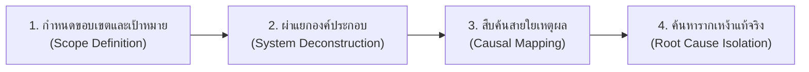

# 01. การคิดเชิงวิเคราะห์ (Analytical Thinking)

> **แกนพิกัด:** แกนความลึก (Deep Dimension)  
> **นิยาม:** ความสามารถในการจำแนก แจกแจง และผ่าโครงสร้างของสิ่งใดสิ่งหนึ่ง ปรากฏการณ์ หรือปัญหาที่ซับซ้อนออกเป็นองค์ประกอบย่อยๆ อย่างมีหลักเกณฑ์ พร้อมทั้งสืบค้นและระบุความสัมพันธ์เชิงเหตุและผล (Causal Relationships) เพื่อให้เข้าใจแก่นแท้ สภาพการณ์ที่เป็นจริง และรากเหง้าของเรื่องราวได้อย่างถ่องแท้

---

## 1. ปรัชญาและกลไกแกนกลาง (Core Cognitive Mechanisms)

หัวใจของการคิดเชิงวิเคราะห์คือ **"การผ่าแยกส่วน" (Deconstruction)** และ **"การค้นหารากเหง้า" (Root Cause Analysis)** เพื่อป้องกันไม่ให้มนุษย์ตกเป็นเหยื่อของการมองเห็นเพียง **"อาการภายนอก" (Symptoms)** แล้วรีบด่วนสรุปแก้ปัญหาแบบลูบหน้าปะจมูก

### กฎทองของการคิดเชิงวิเคราะห์:
1. **หลักความครบถ้วนและไม่ซ้ำซ้อน (MECE - Mutually Exclusive, Collectively Exhaustive):** การผ่าโครงสร้างต้องครอบคลุมทุกมิติโดยที่ส่วนประกอบย่อยไม่เหลื่อมล้ำทับซ้อนกัน
2. **การแยกอาการ (Symptom) ออกจากรากเหง้า (Root Cause):** อาการคือสิ่งที่มองเห็นด้วยตาเปล่า (เช่น ยอดขายตก, พนักงานลาออกสูง) แต่รากเหง้าคือกลไกเชิงระบบที่ซ่อนอยู่ใต้ผิวน้ำ (เช่น โครงสร้างสิ่งจูงใจผิดรูป, วัฒนธรรมองค์กรเป็นพิษ)
3. **การลากเส้นสายใยเหตุผล (Causal Chains):** เข้าใจว่า A นำไปสู่ B และ B ไปกระตุ้น C อย่างไร หลีกเลี่ยงการทึกทักเอาเองว่าสิ่งที่เกิดขึ้นพร้อมกันต้องเป็นเหตุเป็นผลของกันและกัน (Correlation ≠ Causation)

---

## 2. ขั้นตอนการปฏิบัติการ 4 จังหวะ (The 4-Step Analytical Process)

### จังหวะที่ 1: กำหนดขอบเขตและเป้าหมาย (Scope Definition)
- กำหนดให้ชัดเจนว่าจะวิเคราะห์อะไร วิเคราะห์ไปเพื่ออะไร และขอบเขตครอบคลุมช่วงเวลาใดหรือระบบใด เพื่อไม่ให้หลงทางในมหาสมุทรข้อมูล

### จังหวะที่ 2: ผ่าแยกองค์ประกอบย่อย (System Deconstruction)
- ใช้เครื่องมือช่วยผ่า เช่น:
  - **5W1H:** Who (ใครเกี่ยวข้อง), What (เกิดอะไรขึ้น), Where (เกิดที่ไหน), When (เกิดเมื่อใด), Why (ทำไมจึงเกิด), How (เกิดขึ้นได้อย่างไร)
  - **ห่วงโซ่คุณค่า (Value Chain Analysis):** ผ่าตามลำดับกระบวนการตั้งแต่ต้นน้ำถึงปลายน้ำ
  - **โครงสร้างระบบ (Component Breakdown):** ผ่าตามทรัพยากร คน กระบวนการ เทคโนโลยี และงบประมาณ

### จังหวะที่ 3: สืบค้นสายใยความสัมพันธ์เชิงเหตุและผล (Causal Mapping)
- ตรวจสอบว่าแต่ละองค์ประกอบส่งผลกระทบถึงกันอย่างไร เชื่อมโยงเป็นแผนภาพ **Root Cause Tree** หรือ **Fishbone Diagram**
- ตั้งคำถาม "แล้วสิ่งนี้ส่งผลกระทบต่ออะไรต่อ?" (What are the direct and indirect impacts?)

### จังหวะที่ 4: กลั่นกรองรากเหง้าที่แท้จริง (Root Cause Isolation)
- ใช้เทคนิค **5 Whys (ถามเจาะลึก 5 ชั้น)** เพื่อดำดิ่งลงไปจนถึงจุดที่หากแก้ไขจุดนี้ได้ ปัญหาในระดับอาการภายนอกทั้งหมดจะคลี่คลาย

---

## 3. กรอบคำถามตรวจสอบความคิด (Analytical Thinking Prompts)

- [ ] เรื่องนี้ประกอบด้วยองค์ประกอบย่อยอะไรบ้าง สามารถจัดหมวดหมู่อย่างไรให้ครบถ้วนและไม่ซ้ำซ้อน (MECE)?
- [ ] สิ่งที่กำลังเผชิญอยู่นี้ เป็นเพียง "อาการแสดงภายนอก" หรือเป็น "สาเหตุรากเหง้า" กันแน่?
- [ ] ปัจจัยใดที่เป็นตัวแปรต้น (Independent Variable) และปัจจัยใดเป็นตัวแปรตาม (Dependent Variable)?
- [ ] มีความเชื่อมโยงเชิงเหตุผลใดที่ยังขาดหลักฐานสนับสนุน หรือเป็นการด่วนอนุมานไปเอง?
- [ ] หากเจาะลึกลงไป 5 ชั้น (5 Whys) อะไรคือต้นตอเชิงโครงสร้างหรือเชิงพฤติกรรมที่ก่อให้เกิดปัญหานี้?

---

## 4. กับดักที่ต้องระวัง (Cognitive Pitfalls)

1. **Analysis Paralysis (วิเคราะห์จนเป็นอัมพาต):** ติดหล่มกับการขุดลึกรายละเอียดไม่รู้จบจนไม่ได้ลงมือทำ ต้องกำหนดเกณฑ์ "ข้อมูลเพียงพอต่อการตัดสินใจ" (Sufficient Information Threshold) เสมอ
2. **Confusing Correlation with Causation:** สับสนระหว่างสิ่งที่เกิดขึ้นพร้อมกันกับสิ่งที่เป็นสาเหตุจริง
3. **Ignoring the System Loop:** มองความสัมพันธ์เป็นเส้นตรงด้านเดียว (Linear) จนลืมมอง Feedback Loop ที่ย้อนกลับมากระทบตัวต้นเหตุ
