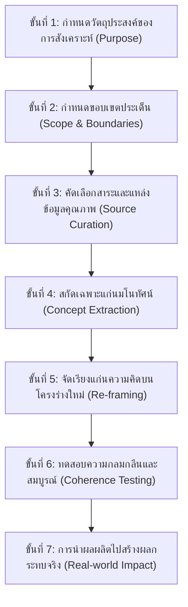

# 03. การคิดเชิงสังเคราะห์ (Synthesis Thinking)

> **แกนพิกัด:** แกนความกว้าง (Broad Dimension)  
> **นิยาม:** ความสามารถในการดึงองค์ประกอบ ข้อมูล หรือแนวคิดย่อยๆ ที่กระจัดกระจาย มาคัดเลือก หลอมรวม และ "ถักทอ" จัดระเบียบภายใต้แกนโครงร่างใหม่ (New Framework) อย่างกลมกลืน ตรงตามวัตถุประสงค์ เพื่อให้กำเนิดสิ่งใหม่หรือแนวคิดใหม่ที่มีเอกลักษณ์และคุณสมบัติเฉพาะตัว ซึ่งไม่เคยปรากฏมาก่อนในองค์ประกอบย่อยดั้งเดิม

---

## 1. ปรัชญาและกลไกแกนกลาง: การถักทอสู่อัตลักษณ์ใหม่ (Weaving into a New Wholeness)

หากการคิดเชิงวิเคราะห์คือ "การผ่าแยกส่วน" การคิดเชิงสังเคราะห์คือกระบวนการตรงกันข้าม นั่นคือ **"การรวมพลังสร้างสรรค์สิ่งใหม่"** โดยผลผลิตที่ได้จะต้องมีคุณสมบัติอุบัติขึ้นใหม่ (Emergent Properties) ที่ผลรวมทั้งหมดมีคุณค่าและพลังเหนือกว่าการนำชิ้นส่วนย่อยมาวางต่อกันธรรมดา

### 2 ลักษณะของการสังเคราะห์:
1. **การสังเคราะห์เชิงรูปธรรม (Concrete Synthesis):** การรวมวัตถุดิบ สารเคมี วงจรอิเล็กทรอนิกส์ หรือชิ้นส่วนเทคโนโลยี เข้าเป็นสิ่งประดิษฐ์ ผลิตภัณฑ์ ยา หรือนวัตกรรมที่จับต้องได้
2. **การสังเคราะห์เชิงนามธรรม (Abstract Synthesis):** การหลอมรวมข้อมูล แนวคิด ปรัชญา หรือทฤษฎีจากหลากสำนัก ให้กลายเป็นโมเดลธุรกิจ (Business Model), ยุทธศาสตร์ใหม่, หรือกรอบความคิดทฤษฎีใหม่

---

## 2. บันได 7 ขั้นแห่งการสังเคราะห์ (The 7-Step Synthesis Ladder)

1. **กำหนดวัตถุประสงค์:** ตอบให้ได้ชัดเจนว่าจะสังเคราะห์สิ่งนี้ขึ้นมาเพื่อแก้ปัญหาอะไร หรือตอบสนองความต้องการใด
2. **กำหนดขอบเขต:** ตีกรอบว่าข้อมูลและองค์ประกอบใดที่เกี่ยวข้อง และอะไรอยู่นอกขอบเขต
3. **คัดเลือกข้อมูลคุณภาพ:** ละทิ้งข้อมูลขยะและแหล่งข้อมูลที่ไม่น่าเชื่อถือ เลือกเฉพาะชิ้นส่วนที่เป็นเพชรแท้
4. **สกัดเฉพาะแก่นมโนทัศน์:** กรองเอารายละเอียดปลีกย่อยทิ้งไป คงไว้เฉพาะสาระสำคัญที่จะเป็นวัตถุดิบตั้งต้น
5. **จัดเรียงบนโครงร่างใหม่ (Re-framing):** คิดค้นโครงสร้างสถาปัตยกรรมใหม่ที่ไม่เคยมีมาก่อน แล้วนำแก่นสาระมาจัดวางลงในตำแหน่งที่เสริมพลังกัน
6. **ทดสอบความกลมกลืน:** ตรวจสอบว่าชิ้นส่วนต่างๆ เข้ากันได้อย่างไร้รอยต่อหรือไม่ มีช่องโหว่หรือความขัดแย้งภายในโครงร่างใหม่หรือไม่
7. **นำไปสร้างผลลัพธ์จริง:** ผลักดันโมเดลหรือสิ่งประดิษฐ์ใหม่ไปสู่การปฏิบัติการ

---

## 3. กลไกวิภาษวิธี (Dialectics: Thesis + Antithesis -> Synthesis)

หัวใจสำคัญของการสังเคราะห์ชั้นสูงคือการไม่หลีกเลี่ยง "ความขัดแย้ง" แต่นำข้อเสนอตรงข้ามสองขั้วมาหลอมรวมกัน:
- **ข้อเสนอหลัก (Thesis):** แนวทางเดิมหรือความต้องการด้านหนึ่ง (เช่น ต้องการสินค้าคุณภาพระดับพรีเมียม)
- **ข้อเสนอแย้ง (Antithesis):** ข้อจำกัดหรือความต้องการตรงข้าม (เช่น ลูกค้ามีงบประมาณจำกัดมาก)
- **การสังเคราะห์ (Synthesis):** ไม่ใช่การประนีประนอมแบบครึ่งๆ กลางๆ (Compromise) แต่คือการคิดค้นโมเดลใหม่ที่ให้ทั้งคุณภาพระดับพรีเมียมในราคาที่เข้าถึงได้ (เช่น โมเดล Fast Fashion หรือ Platform Shared Infrastructure)

---

## 4. กรอบคำถามตรวจสอบความคิด (Synthesis Thinking Prompts)

- [ ] เมื่อนำแก่นสาระของแต่ละแนวคิดหรือเทคโนโลยีเหล่านี้ออกมา จะสามารถนำมาถักทอจัดระเบียบใหม่เป็นสิ่งใดได้บ้าง?
- [ ] โครงร่างใหม่ (New Framework) ที่เรากำลังสร้างขึ้นมานี้ มีความแตกต่างและโดดเด่นจากโครงสร้างเดิมอย่างไร?
- [ ] มีข้อเสนอสองขั้วที่ดูเหมือนขัดแย้งกัน (Thesis vs Antithesis) ที่เราสามารถหลอมรวมให้เกิดโซลูชันใหม่ได้หรือไม่?
- [ ] สิ่งที่สังเคราะห์ขึ้นมาใหม่นี้ มีคุณสมบัติเฉพาะที่เหนือกว่าผลรวมของส่วนประกอบย่อยดั้งเดิม (Emergent Value) อย่างไร?
- [ ] องค์ประกอบทุกส่วนในโมเดลใหม่นี้สอดประสานกันอย่างกลมกลืน ไร้รอยต่อ และตอบวัตถุประสงค์หลักหรือไม่?
