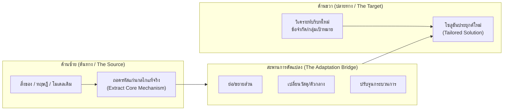

# 07. การคิดเชิงประยุกต์ (Applicative Thinking)

> **แกนพิกัด:** แกนความกว้าง (Broad Dimension)  
> **นิยาม:** ความสามารถในการนำเอาหลักการ แนวคิด ทฤษฎี วัตถุสิ่งของ หรือเครื่องมือที่มีอยู่เดิมในบริบทหนึ่ง ไปปรับใช้ แก้ไข ดัดแปลง ให้สอดคล้องเหมาะสมและเกิดประสิทธิภาพสูงสุดในบริบทใหม่หรือสถานการณ์ใหม่ เพื่อหลุดพ้นจากการเป็นทาสของประสบการณ์เดิมและการลอกเลียนแบบอย่างไร้เดียงสา

---

## 1. ปรัชญาและกลไกแกนกลาง: การคิดจากซ้ายไปขวา (Thinking from Left to Right)

การลอกเลียนแบบตรงๆ (Copy-Paste) มักล้มเหลวเสมอ เพราะบริบท สภาพแวดล้อม และทรัพยากรของแต่ละสถานการณ์ไม่เคยเหมือนกัน การคิดเชิงประยุกต์จึงไม่ใช่การก๊อปปี้ แต่คือ **"ศิลปะการถ่ายโอนแก่นหลักการข้ามบริบท"**

---

## 2. ขั้นตอนการประยุกต์ 3 ระยะ (The 3-Phase Transfer Protocol)

### ระยะที่ 1: ถอดรหัสต้นทาง (Decode the Source - ด้านซ้าย)
- ศึกษาว่าสิ่งที่สำเร็จในบริบทเดิมนั้น "สำเร็จเพราะอะไรกันแน่?" สกัดแยกเฉพาะ **กฎแก่นแท้ (Underlying Principle)** ออกมาจากเปลือกนอกทางกายภาพ
- ตัวอย่าง: รถยนต์ Tesla สำเร็จไม่ใช่เพราะเป็น "รถเก๋ง" แต่สำเร็จเพราะ "เป็นคอมพิวเตอร์ติดล้อที่มีสถาปัตยกรรมซอฟต์แวร์ควบคุมจากศูนย์กลาง"

### ระยะที่ 2: วิเคราะห์เงื่อนไขปลายทาง (Scrutinize the Target - ด้านขวา)
- วิเคราะห์สภาพแวดล้อมของหน้างานใหม่ ข้อจำกัดด้านงบประมาณ กฎหมาย วัฒนธรรมผู้ใช้งาน และโครงสร้างพื้นฐาน
- สังเกตว่าอะไรที่ปลายทางมี และอะไรที่ปลายทางขาด

### ระยะที่ 3: ออกแบบสถาปัตยกรรมการดัดแปลง (Re-engineering the Transfer)
- ใช้กลวิธีดัดแปลง 4 รูปแบบ:
  1. **Scale Adaptation (ปรับขนาด):** ย่อส่วนโมเดลระดับองค์กรใหญ่ให้กลายเป็นโซลูชันสำหรับ SME หรือขยายระบบย่อยให้รองรับระดับประเทศ
  2. **Medium Replacement (เปลี่ยนตัวกลาง/สื่อ):** เปลี่ยนจากการพบหน้าตัวต่อตัวเป็นการให้บริการดิจิทัล หรือเปลี่ยนวัตถุดิบแพงเป็นของเหลือใช้ทางการเกษตร
  3. **Modular Re-assembly (ตัดแต่งชิ้นส่วน):** ดึงมาใช้เฉพาะ 2 ส่วนที่มีประโยชน์ ทิ้ง 3 ส่วนที่ไม่จำเป็นในบริบทใหม่
  4. **Functional Repurposing (เปลี่ยนหน้าที่การใช้งาน):** นำสิ่งของที่ถูกทิ้งหรือไม่ถูกใช้งาน มาทำหน้าที่เป็นเครื่องมือแก้ปัญหาใหม่

---

## 3. กรอบคำถามตรวจสอบความคิด (Applicative Thinking Prompts)

- [ ] แก่นแท้หรือกลไกความสำเร็จของสิ่งนี้ในบริบทเดิมคืออะไร (ถอดรหัสเปลือกนอกออกแล้วหรือยัง)?
- [ ] บริบทใหม่ที่เราต้องการนำไปใช้ มีเงื่อนไข ข้อจำกัด หรือความต้องการเฉพาะใดที่แตกต่างจากบริบทเดิมอย่างมีนัยสำคัญ?
- [ ] ต้องดัดแปลง ตัดทอน ขยายส่วน หรือเปลี่ยนองค์ประกอบใด เพื่อให้เข้ากับสภาพแวดล้อมใหม่ได้อย่างไร้รอยต่อ?
- [ ] มีผลข้างเคียงหรือความเสี่ยงใดบ้างจากการถ่ายโอนความรู้เดิมมาใช้ (Negative Side-effects)?
- [ ] มีทรัพยากร สิ่งของ หรือระบบใกล้ตัวใด ที่สามารถนำมาดัดแปลงใช้แก้ปัญหานี้ได้ทันทีโดยไม่ต้องลงทุนสูง?
