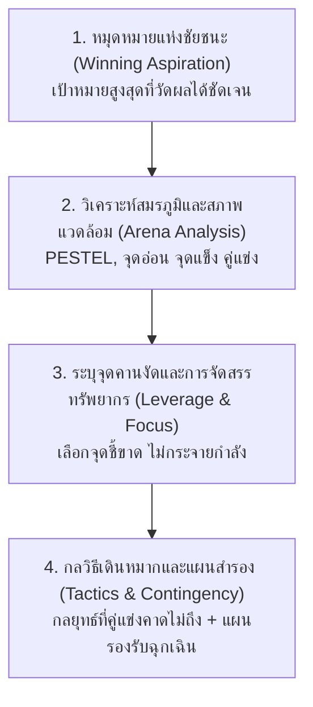

# 08. การคิดเชิงกลยุทธ์ (Strategic Thinking)

> **แกนพิกัด:** แกนความไกล (Far Dimension)  
> **นิยาม:** ความสามารถในการกำหนดวิสัยทัศน์หรือเป้าหมายระยะยาวที่ชัดเจน แล้วออกแบบเส้นทาง กลวิธี วิธีการดำเนินงาน และชั้นเชิงที่มีประสิทธิผลสูงสุด ภายใต้การประเมินสภาพแวดล้อมที่เปลี่ยนแปลงแบบพลวัต ปัจจัยเอื้อ อุปสรรค และข้อจำกัดด้านทรัพยากร เพื่อสร้าง "ความเป็นต่อ" หรือความได้เปรียบทางการแข่งขันอย่างยั่งยืน

---

## 1. ปรัชญาและกลไกแกนกลาง: การเดินหมากหลายชั้นและจุดคานงัด

การคิดเชิงกลยุทธ์มีลักษณะเป็น **การคิดแบบไม่เป็นเส้นตรง (Non-linear Thinking)** และเป็นการมองข้ามกระดานไปข้างหน้าหลายชั้นหมาก (Playing Multiple Moves Ahead) ยุทธศาสตร์ที่ดีไม่ใช่การทำทุกอย่าง แต่คือ **"การเลือกที่จะไม่ทำสิ่งใด" (Trade-offs)** เพื่อทุ่มเททรัพยากรที่มีอยู่อย่างจำกัดลงไปยังจุดที่เกิดผลสูงสุด

### 2 เสาหลักสำคัญของนักคิดเชิงกลยุทธ์:
1. **การค้นหาจุดคานงัด (The Leverage Point):** ตำแหน่งในระบบที่เมื่อออกแรงกระทำเพียงเล็กน้อย จะส่งแรงกระเพื่อมและสร้างผลลัพธ์การเปลี่ยนแปลงมหาศาล (ออกแรง 1 ส่วน ได้ผล 10 ส่วน)
2. **การสร้างปราการทางธุรกิจหรือคูเมือง (Strategic Moat):** การออกแบบกลไกป้องกันที่ทำให้คู่แข่งลอกเลียนแบบได้ยาก และรักษาความได้เปรียบได้อย่างยั่งยืน

```text
┌─────────────────────────────────────────────────────────────┐
│             5 ปราการคูเมืองทางธุรกิจ (Strategic Moats)        │
├─────────────────────────────────────────────────────────────┤
│ 1. Network Effects (ผลกระทบเครือข่าย ยิ่งคนใช้มาก คุณค่ายิ่งสูง)│
│ 2. High Switching Costs (ต้นทุนในการเปลี่ยนไปใช้เจ้าอื่นสูง)  │
│ 3. Cost Advantage (ความได้เปรียบด้านต้นทุนเชิงโครงสร้าง/สเกล) │
│ 4. Intangible Assets (สิทธิบัตร แบรนด์ ใบอนุญาตเฉพาะทาง)     │
│ 5. Counter-positioning (โมเดลใหม่ที่เจ้าตลาดเดิมไม่กล้าทำตาม)  │
└─────────────────────────────────────────────────────────────┘
```

---

## 2. ขั้นตอนปฏิบัติการ 4 ชั้นเชิง (The 4-Pillar Strategic Roadmap)



---

## 3. กรอบคำถามตรวจสอบความคิด (Strategic Thinking Prompts)

- [ ] หมุดหมายแห่งชัยชนะสูงสุด (Winning Goal) คืออะไร และมีตัวชี้วัดความสำเร็จที่จับต้องได้อย่างไร?
- [ ] ในระบบที่ซับซ้อนนี้ "จุดคานงัด" (Leverage Point) ที่ออกแรงน้อยที่สุดแต่สร้างผลกระทบเชิงระบบสูงสุดอยู่ที่ใด?
- [ ] กลยุทธ์นี้สร้าง "ความเป็นต่อ" ที่คู่แข่งคาดไม่ถึง และยากต่อการลอกเลียนแบบอย่างไร (Moat)?
- [ ] หากคู่แข่งแก้เกม หรือสถานการณ์ภายนอกพลิกผัน เราได้เตรียมแผนสำรอง (Contingency Plan) ไว้อย่างไร?
- [ ] สิ่งที่เราตัดสินใจ "ไม่ทำ" (What NOT to do) เพื่อรักษาโฟกัสของทรัพยากรคืออะไร?
