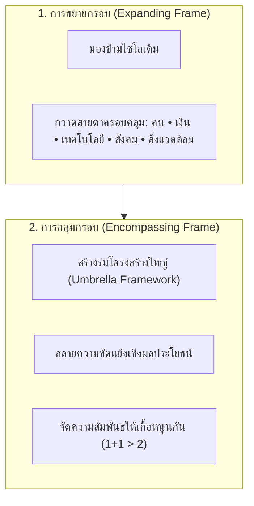

# 09. การคิดเชิงบูรณาการ (Integrative Thinking)

> **แกนพิกัด:** แกนความกว้าง (Broad Dimension)  
> **นิยาม:** ความสามารถในการมองภาพรวมเชิงระบบแบบองค์รวม (Holistic View) โดยการเชื่อมประสานองค์ประกอบ ศาสตร์ สาขาวิชา หรือมิติต่างๆ ที่หลากหลายและอาจดูเหมือนขัดแย้งกัน ให้เข้ามาอยู่ร่วมกันอย่างเป็นเอกภาพและสอดประสานกัน เพื่อป้องกันภาวะ "ตาบอดคลำช้าง" และทำให้ผลลัพธ์ที่เกิดขึ้นมีคุณค่าและพลังทวีคูณมากกว่าผลรวมของส่วนย่อยแยกขาดจากกัน (1+1 > 2)

---

## 1. ปรัชญาและ 2 กลไกขับเคลื่อน (Expanding & Encompassing Frames)

ปัญหาเรื้อรังส่วนใหญ่ในองค์กรและสังคม มักเกิดจากการทำงานแบบแยกส่วน (Silo Mentality) และการมองโลกแบบ "ตาบอดคลำช้าง" ที่แต่ละฝ่ายยึดติดผลประโยชน์ของตนเอง การคิดเชิงบูรณาการแก้ปัญหานี้ผ่าน 2 เครื่องมือทางปัญญา:

1. **หลักการขยายกรอบ (Expanding Frame):** ดึงสายตาออกจากกรอบแคบๆ ของฝ่ายตนเอง กวาดมองให้เห็นมิติแวดล้อมทั้งหมดที่เกี่ยวพัน ทั้งมิติมนุษย์ การเงิน เทคโนโลยี กฎหมาย และสังคม
2. **หลักการคลุมกรอบ (Encompassing Frame):** การกาง "ร่มใหญ่" ที่ครอบคลุมทุกฝ่าย จัดวางผลประโยชน์ใหม่จนทุกฝ่ายเห็นว่าเป้าหมายร่วมกันนั้นมีค่ายิ่งกว่าผลประโยชน์ย่อยส่วนตน

---

## 2. การเปลี่ยนความขัดแย้งสู่พลังทวีคูณ (From Conflict to Synergy)

เมื่อเกิดความขัดแย้งระหว่างส่วนงาน (เช่น ฝ่ายขายต้องการตอบสนองลูกค้าเร็วที่สุด vs ฝ่ายผลิตต้องการคุมต้นทุนให้ต่ำสุด vs ฝ่ายความปลอดภัยต้องการตรวจสอบเข้มงวดที่สุด):
- **การคิดแบบแยกส่วน:** ต่อรองแบบ Compromise ทุกฝ่ายยอมเสียบางส่วน ผลลัพธ์แย่ลง
- **การคิดเชิงบูรณาการ:** ออกแบบระบบใหม่ที่ทำให้กระบวนการตรวจสอบอัตโนมัติ ช่วยทั้งลดต้นทุน เร่งความเร็ว และเพิ่มความปลอดภัยพร้อมกัน (Win-Win-Win Synergy)

---

## 3. กรอบคำถามตรวจสอบความคิด (Integrative Thinking Prompts)

- [ ] ภาพรวมของระบบนี้ มีมิติ ศาสตร์ หรือภาคส่วนใดที่ยังถูกมองข้ามหรือทำงานแบบแยกส่วน (Silo) อยู่บ้าง?
- [ ] มีความขัดแย้งเชิงผลประโยชน์ใดระหว่างผู้มีส่วนได้ส่วนเสีย (Stakeholders) ที่ต้องสร้าง "กรอบใหญ่คลุม" เพื่อสลายความขัดแย้ง?
- [ ] จะจัดวางความสัมพันธ์ระหว่างคน เทคโนโลยี งบประมาณ และนโยบายอย่างไรให้สอดประสานกันอย่างเป็นเอกภาพ?
- [ ] ผลลัพธ์สุดท้ายของการประสานระบบนี้ ก่อให้เกิดพลังทวีคูณมากกว่าผลรวมของส่วนย่อย (Synergistic 1+1 > 2) หรือไม่?
- [ ] แผนงานนี้ช่วยป้องกันภาวะ "เสียน้อยเสียยาก เสียมากเสียง่าย" ในระยะยาวแล้วหรือยัง?
