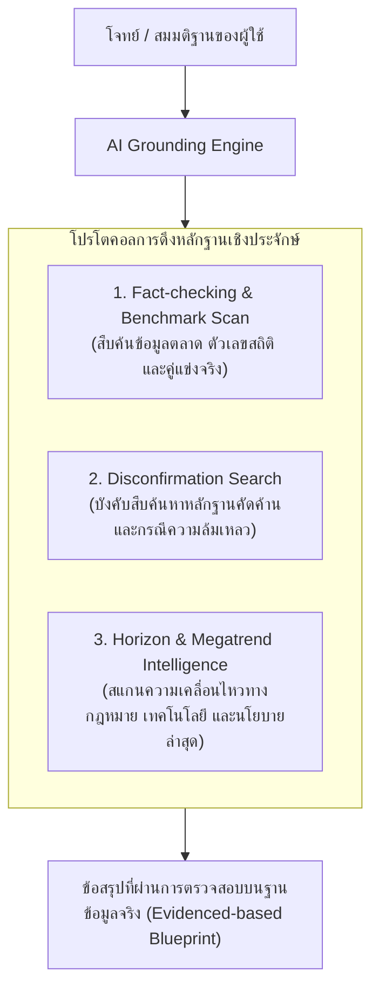

# เครื่องมือตรวจสอบข้อเท็จจริงและหลักฐานเชิงประจักษ์ (Live Evidence & Market Grounding)

> **วัตถุประสงค์:** โปรโตคอลการผูกชุดความคิดเข้ากับข้อมูลจริงในโลกภายนอก (Real-World Evidence Grounding) ผ่านเครื่องมือสืบค้นและคลังข้อมูล เพื่อป้องกันการสรุปบนข้อมูลที่คลาดเคลื่อน (Hallucination) หรืออคติยืนยันของตนเอง

---

## 🔍 3 โปรโตคอลการดึงหลักฐานสด (The 3 Grounding Protocols)

---

## 1. Fact-checking & Benchmark Scan (กำกับโดย: คิดเชิงวิพากษ์ + วิเคราะห์)
- **เมื่อใดที่ต้องใช้:** เมื่อมีการอ้างตัวเลขขนาดตลาด, พฤติกรรมผู้บริโภค, ต้นทุน, หรือสเปกเทคโนโลยี
- **แนวทางปฏิบัติการ:**
  - แปลงข้ออ้าง (Premise) ให้เป็นคีย์เวิร์ดการสืบค้นที่เฉพาะเจาะจง
  - ค้นหาตัวเลขจากแหล่งข้อมูลทางการ (เช่น รายงานวิจัยตลาด, งบการเงินบริษัทจดทะเบียน, สถิติภาครัฐ)
  - นำข้อมูลดิบมาตรวจสอบความสอดคล้องตามหลัก MECE ก่อนนำมาใช้

---

## 2. The Disconfirmation Search (การค้นหาหลักฐานคัดค้านเพื่อทลายอคติ)
- **หลักการ:** มนุษย์มักค้นหาเฉพาะสิ่งที่สนับสนุนความคิดของตนเอง (Confirmation Bias)
- **แนวทางปฏิบัติการ:**
  - บังคับให้ AI ตั้งคำถามค้นหาขั้วตรงข้ามเสมอ เช่น:
    - *"ทำไมโมเดลธุรกิจแนวนี้ถึงเคยล้มเหลวมาก่อน?" (Post-mortem case studies)*
    - *"ความเสี่ยง ปัญหา หรือข้อร้องเรียนของผู้ใช้บริการประเภทนี้คืออะไร?"*
    - *"มีงานวิจัยใดที่คัดค้านประสิทธิภาพของวิธีการนี้หรือไม่?"*
  - นำกรณีศึกษาความล้มเหลวในอดีตมาใช้เป็นเกราะป้องกันความเสี่ยงล่วงหน้า

---

## 3. Horizon & Megatrend Intelligence (กำกับโดย: คิดเชิงอนาคต + กลยุทธ์)
- **เมื่อใดที่ต้องใช้:** เมื่อต้องการวางฉากทัศน์อนาคต (Scenario Planning) หรือออกแบบคูเมืองทางธุรกิจ
- **แนวทางปฏิบัติการ:**
  - สแกนแนวโน้มการเปลี่ยนแปลงของกฎหมายและนโยบายภาครัฐ (เช่น กฎหมาย PDPA, ภาษีคาร์บอน, นโยบายส่งเสริม AI)
  - ตรวจจับสัญญาณเตือนภัยล่วงหน้า (Early Warning Signals) จากความเคลื่อนไหวของผู้นำอุตสาหกรรมระดับโลก
  - นำผลการสแกนมาทดสอบความทนทานของโมเดลธุรกิจใน 3 ฉากทัศน์ (Best, Base, Worst)
