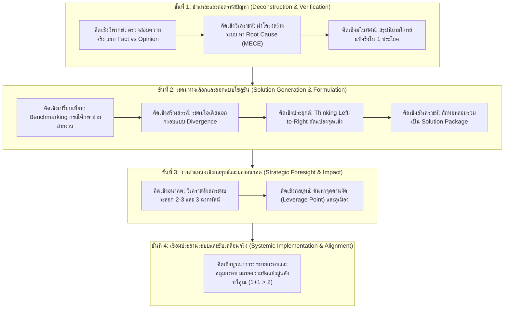

# คู่มือปฏิบัติการ: การแก้ปัญหาที่ซับซ้อน (Playbook: Complex Problem Solving Protocol)

> **วัตถุประสงค์:** โปรโตคอลการคิด 4 ขั้นตอน สำหรับการแก้ปัญหาที่มีความซับซ้อนสูง มีตัวแปรแฝง และส่งผลกระทบในวงกว้าง (เช่น วิกฤตการณ์ทางธุรกิจ ความขัดแย้งเชิงโครงสร้างองค์กร หรือการปรับเปลี่ยนทิศทางเชิงยุทธศาสตร์) โดยการบูรณาการชุดความคิดทั้ง 10 มิติอย่างสอดประสาน

---

## ภาพรวมกระบวนการ 4 จังหวะ (The 4-Stage CPS Architecture)

---

## ขั้นตอนที่ 1: ชำแหละและถอดรหัสปัญหา (Problem Deconstruction & Verification)

### 1.1 คิดเชิงวิพากษ์ (Critical Verification):
- **กรองข้อมูล:** คัดแยกข้อเท็จจริง (Fact) ออกจากความคิดเห็น (Opinion) และอคติของทีมงาน
- **ตรวจสอบสมมติฐาน:** ตั้งคำถามว่า "สิ่งที่ทุกคนเชื่อว่าเป็นต้นเหตุของปัญหานี้ มีหลักฐานเชิงประจักษ์พิสูจน์แล้วหรือยัง?"

### 1.2 คิดเชิงวิเคราะห์ (Analytical Deconstruction):
- **ผ่าโครงสร้าง:** แยกส่วนประกอบของระบบออกเป็นส่วนย่อยตามหลัก MECE (คน, กระบวนการ, เทคโนโลยี, สภาพแวดล้อม)
- **เจาะลึก 5 Whys:** ลากเส้นสายใยเหตุผลจากอาการภายนอก (Symptoms) ดำดิ่งลงไปสู่ **สาเหตุรากเหง้า (Root Cause)**

### 1.3 คิดเชิงมโนทัศน์ (Conceptual Definition):
- **สรุปโจทย์แท้จริงใน 1 ประโยค:** กลั่นกรองสาระทั้งหมดให้กลายเป็นการนิยามโจทย์ที่ถูกต้อง กระชับ และคมชัด เช่น:
  > *"โจทย์ไม่ใช่เรื่องลูกค้าร้องเรียนเรื่องความล่าช้า แต่คือความล้มเหลวของการสื่อสารความคาดหวังในจุดส่งมอบงาน"*

---

## ขั้นตอนที่ 2: ระดมทางเลือกและออกแบบโซลูชัน (Solution Generation & Formulation)

### 2.1 คิดเชิงเปรียบเทียบ (Comparative Benchmarking):
- สแกนดูว่าในอุตสาหกรรมอื่น หรือในอดีต มีใครเคยเจอปัญหาที่มีแบบแผนคล้ายกันนี้บ้าง และพวกเขาแก้อย่างไร

### 2.2 คิดเชิงสร้างสรรค์ (Creative Ideation):
- ปลดล็อกข้อจำกัดทางทรัพยากรและเวลา ระดมไอเดียแปลกใหม่ด้วยเทคนิคการคิดกลับด้าน (Inversion) และการเชื่อมโยงสิ่งที่ไม่คุ้นเคย

### 2.3 คิดเชิงประยุกต์ (Applicative Adaptation):
- ถอดรหัสกลไกความสำเร็จของแนวปฏิบัติที่ดี (Best Practices) จากด้านซ้าย แล้วนำมาดัดแปลงให้เข้ากับเงื่อนไขหน้างานจริงทางด้านขวา

### 2.4 คิดเชิงสังเคราะห์ (Synthesis Packaging):
- คัดเลือกแก่นของแต่ละไอเดีย แล้วถักทอเข้าด้วยกันภายใต้แกนโครงสร้างใหม่ เกิดเป็น **ชุดแพ็กเกจทางออก (Comprehensive Solution Package)** ที่สลายข้อขัดแย้งเดิม

---

## ขั้นตอนที่ 3: วางตำแหน่งเชิงกลยุทธ์และประเมินผลกระทบระยะยาว (Strategic Foresight)

### 3.1 คิดเชิงอนาคต (Futuristic Foresight):
- **ประเมินผลกระทบระลอกสองและสาม (Higher-Order Consequences):** ทางออกนี้จะสร้างผลข้างเคียงอะไรตามมาในอีก 6-12 เดือนข้างหน้า?
- **ทดสอบ 3 ฉากทัศน์ (Scenarios):** หากสถานการณ์ดำเนินไปในทางดีสุด (Best Case), ปกติ (Base Case), หรือเลวร้ายสุด (Worst Case) โซลูชันนี้ยังคงใช้งานได้หรือไม่?

### 3.2 คิดเชิงกลยุทธ์ (Strategic Positioning):
- **ค้นหาจุดคานงัด (Leverage Point):** เลือกจุดที่มีประสิทธิภาพสูงสุดในการลงมือทำ ออกแรง 20% ที่สร้างผลลัพธ์ 80%
- **สร้างคูเมือง (Moat):** วางหมากให้การแก้ปัญหานี้กลายเป็นขีดความสามารถการแข่งขันใหม่ที่คู่แข่งลอกเลียนแบบได้ยาก

---

## ขั้นตอนที่ 4: เชื่อมประสานระบบและการลงมือปฏิบัติการ (Systemic Implementation & Alignment)

### 4.1 คิดเชิงบูรณาการ (Integrative System Alignment):
- **การขยายกรอบ (Expanding Frame):** กวาดสายตาให้ครอบคลุมทุกมิติ ทั้งฝ่ายบริหาร พนักงานหน้างาน ลูกค้า ซัพพลายเออร์ และข้อกฎหมาย
- **การคลุมกรอบ (Encompassing Frame):** ออกแบบระบบที่ประสานผลประโยชน์ของทุกฝ่ายให้ลงตัว เปลี่ยนความขัดแย้งของไซโลให้กลายเป็นความร่วมมือแบบ Win-Win (1+1 > 2)
- **แผนผังสถาปัตยกรรมการลงมือทำ:** จัดทำ Action Plan ที่ระบุผู้รับผิดชอบ ตัวชี้วัด และเส้นตายอย่างชัดเจน
