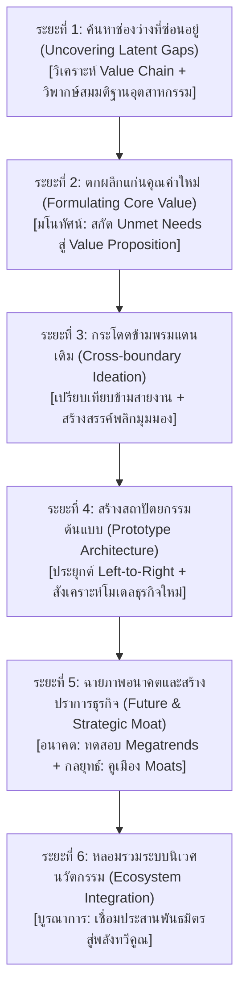

# คู่มือปฏิบัติการ: ท่อส่งนวัตกรรม 10 มิติ (Playbook: The 10-D Transformative Innovation Pipeline)

> **วัตถุประสงค์:** กรอบการทำงาน 6 ระยะ สำหรับการบ่มเพาะและพัฒนาผลิตผล นวัตกรรมบริการ หรือโมเดลธุรกิจเชิงปฏิรูป (Breakthrough / Transformative Innovation) ที่เปลี่ยนความคลุมเครือให้กลายเป็นธุรกิจที่มีความได้เปรียบยั่งยืน

---

## สถาปัตยกรรมท่อส่งนวัตกรรม 6 ระยะ (The 10-D Innovation Funnel)

---

## ระยะที่ 1: ค้นหาช่องว่างที่ซ่อนอยู่ (Uncovering Latent Gaps)
- **คิดเชิงวิเคราะห์ (Value Chain Deconstruction):** ชำแหละเส้นทางการเดินทางของลูกค้า (Customer Journey) และห่วงโซ่คุณค่า เพื่อค้นหาจุดฝืดเคือง (Friction Points) ความล่าช้า และต้นทุนแฝงที่ไม่มีใครสนใจ
- **คิดเชิงวิพากษ์ (Challenging Dogmas):** ลิสต์กฎเกณฑ์หรือความเชื่อดั้งเดิมของอุตสาหกรรม แล้วท้าทายด้วยคำถาม: *"ทำไมอุตสาหกรรมนี้ต้องทำแบบนี้เสมอ? กฎนี้เป็นข้อเท็จจริงทางกายภาพ หรือเป็นเพียงความคุ้นชินเก่า?"*

---

## ระยะที่ 2: ตกผลึกแก่นคุณค่าใหม่ (Formulating Core Conceptual Value)
- **คิดเชิงมโนทัศน์ (Core Value Essence):** สกัดความต้องการที่แท้จริงที่ยังไม่ได้รับการตอบสนอง (Unmet Deep Needs) ของมนุษย์ ให้ออกมาเป็น **แก่นคุณค่าใหม่ (Value Proposition)** เพียงหนึ่งประโยคทอง
- *ตัวอย่าง:* สกัดจาก "คนไม่อยากซื้อสว่าน" ไปสู่แก่นแท้คือ "คนต้องการรูบนผนังที่มีขนาดพอดีและเรียบร้อย"

---

## ระยะที่ 3: กระโดดข้ามพรมแดนเดิม (Cross-boundary Ideation)
- **คิดเชิงเปรียบเทียบ (Cross-industry Analogy):** นำโมเดลความสำเร็จจากอุตสาหกรรมอื่นมาเทียบเคียง เช่น "หากธุรกิจนี้ทำงานเหมือนโรงแรม Airbnb หรือสายการบินโลว์คอสต์ จะมีหน้าตาอย่างไร?"
- **คิดเชิงสร้างสรรค์ (Radical Divergence):** ใช้เทคนิคการคิดกลับด้าน (Inversion) และ 4 เสาหลักความคิดสร้างสรรค์ ระดมแนวคิดผลิตภัณฑ์/บริการที่ไม่เคยมีใครทำมาก่อน

---

## ระยะที่ 4: สร้างสถาปัตยกรรมต้นแบบ (Prototype Architecture)
- **คิดเชิงประยุกต์ (Thinking Left-to-Right):** ถ่ายโอนเทคโนโลยี กลไก หรืออัลกอริทึมที่ผ่านการพิสูจน์แล้วจากสายงานอื่น มาดัดแปลง ย่อส่วน หรือปรับแต่งให้เข้ากับบริบทใหม่
- **คิดเชิงสังเคราะห์ (Business Model Synthesis):** นำองค์ประกอบด้านเทคโนโลยี ประสบการณ์ลูกค้า และโมเดลการสร้างรายได้ (Revenue Engine) มาถักทอเข้าด้วยกันเป็นข้อเสนอนวัตกรรมที่สมบูรณ์และใช้งานได้จริง

---

## ระยะที่ 5: ฉายภาพอนาคตและสร้างปราการทางธุรกิจ (Future Alignment & Strategic Moat)
- **คิดเชิงอนาคต (Foresight Stress Test):** นำโมเดลนวัตกรรมไปทดสอบกับแนวโน้ม Megatrends ในอีก 5-10 ปีข้างหน้า ทั้งมิติด้านประชากรศาสตร์ สิ่งแวดล้อม และเทคโนโลยี AI เพื่อป้องกันไม่ให้นวัตกรรมล้าสมัยก่อนเปิดตัว
- **คิดเชิงกลยุทธ์ (Defensive Moat):** ออกแบบกลไกสร้างคูเมืองทางธุรกิจตั้งแต่ขั้นตอนแรก เช่น การสร้าง Network Effects, ต้นทุนการเปลี่ยนผ่านสูง (Switching Costs), หรือการสร้างความได้เปรียบด้านต้นทุนเชิงโครงสร้าง

---

## ระยะที่ 6: หลอมรวมระบบนิเวศนวัตกรรม (Ecosystem Integration)
- **คิดเชิงบูรณาการ (Holistic Ecosystem Synergy):** นวัตกรรมที่ยิ่งใหญ่ต้องมีระบบนิเวศรองรับ ออกแบบกลไกเชื่อมโยงผลประโยชน์ของพันธมิตร ซัพพลายเออร์ ชุมชน และผู้ใช้งาน ให้ทุกคนได้รับประโยชน์ร่วมกันจนเกิดผลลัพธ์ทวีคูณ (1+1 > 2)
